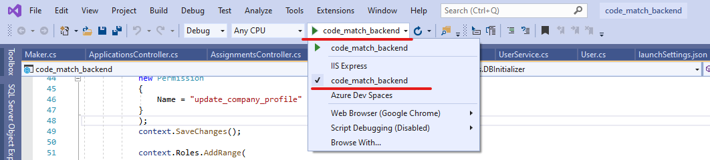
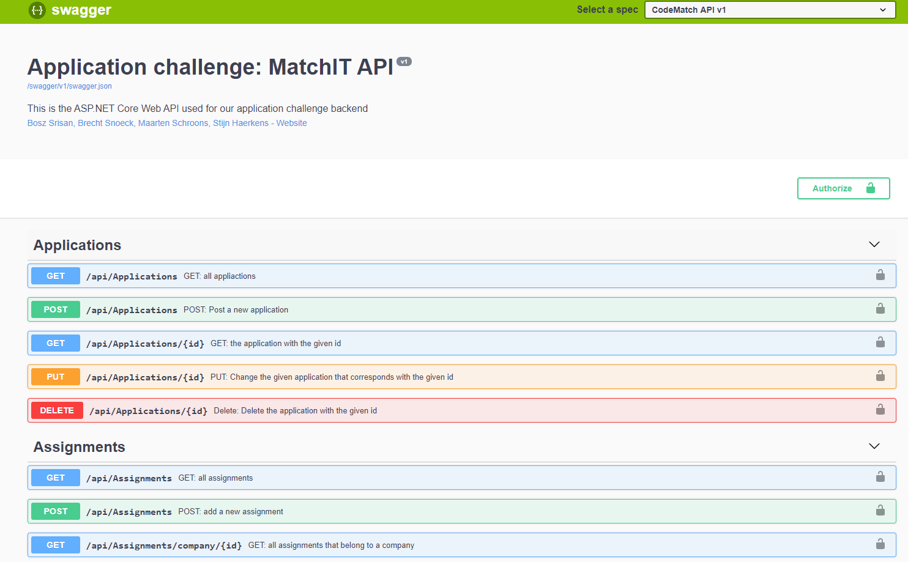

# Application challenge: MatchIT

## Project description

The assignment application challenge 2019 organized by the Grasshoppers Academy. Is a challenge made for students in their last year of the IT-Factory. The assignment, “The Matchmaking System”, is platform designed for students, interns or any other person who does IT in his spare time. The goal is to bring these people in contact with companies that have “not so urgent” assignments, but they still want to have looked at.

A couple examples would be: Designs, Websites, Applications, Data modeling, …

## Team: CodeMatchers (Athene)

This assignment wasn’t made for one student to complete, but for a team of students. Our team the “CodeMatchers” consists of 4 students. together we build our application "MatchIT".
  * Bosz Srisan (BoszS)
  * Brecht Snoeck (BrechtSnoeck)
  * Maarten Schroons (maartenschroons)
  * Stijn Haerkens (stijnhhh)

## What's in this Repo?

In this repository you can find the backend that we made for the application challenge. This Backend was made using Visual Studio + .NET Core SDK 2.2 API template. We chose to use .NET because we have the most experience with it. The backend isn’t hosted anywhere, so you’ll have to clone into this repo to get started!  --> more information ahead! 

## Installation

* First you will have to clone/ download this repository. 
  * Clone the repo using: git clone https://github.com/BoszS/CodeMatchBackend.git
  * Or you can download the ZIP file and unpack it where you need it to be!
* After that you can use Visual Studio 2017/2019 to open the project. 

  * **!!Be aware!!** Visual studio 2017 doesn't work with all .NET Core SDK 2.2 versions! If you are missing the right SDK, you can use the following link to download it https://dotnet.microsoft.com/download/dotnet-core/2.2
  
* Finally when you have the project open in Visual Studio you can launch the project. Make sure to launch it using the correct launcher profile. Use the “code_match_backend” profile. This makes sure the API is running on the right port! Use the image below for reference.

 
 
 ## Swagger documentation
 
The backend is configured to make use of the Swagger documentation. The Swagger page automatically launches when you start the backend. If you want to take a look at all the controllers and models, you can find the documented at https://localhost:5001/swagger/index.html.

### Controlers and methods
Below you can see an image of the swagger page. It contains the controllers and models of the backend.
 
 
 ## Frontend
 
 Want to have a look at what the frontend looks like? Just click on the following link!
 https://github.com/maartenschroons/CodeMatchFrontend
